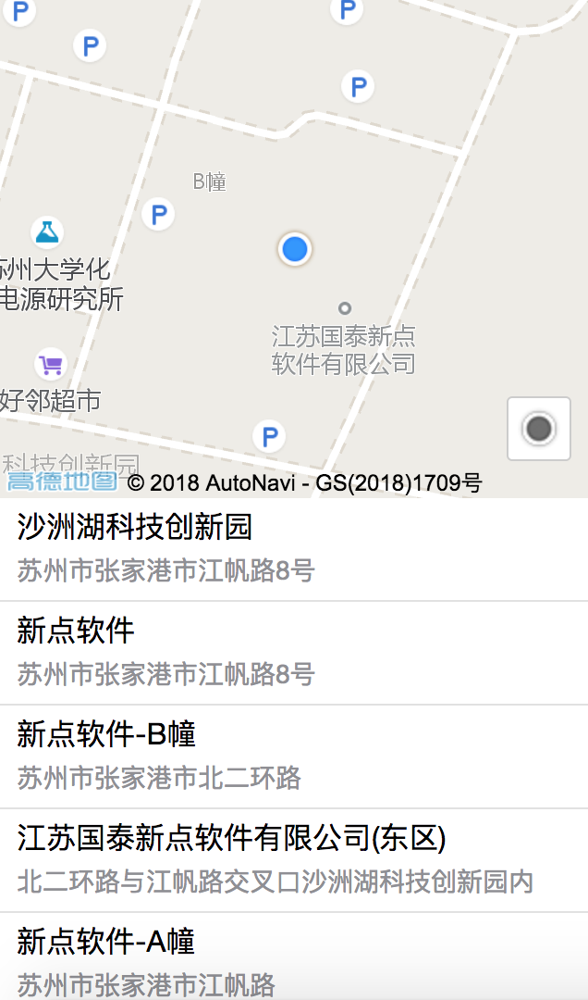
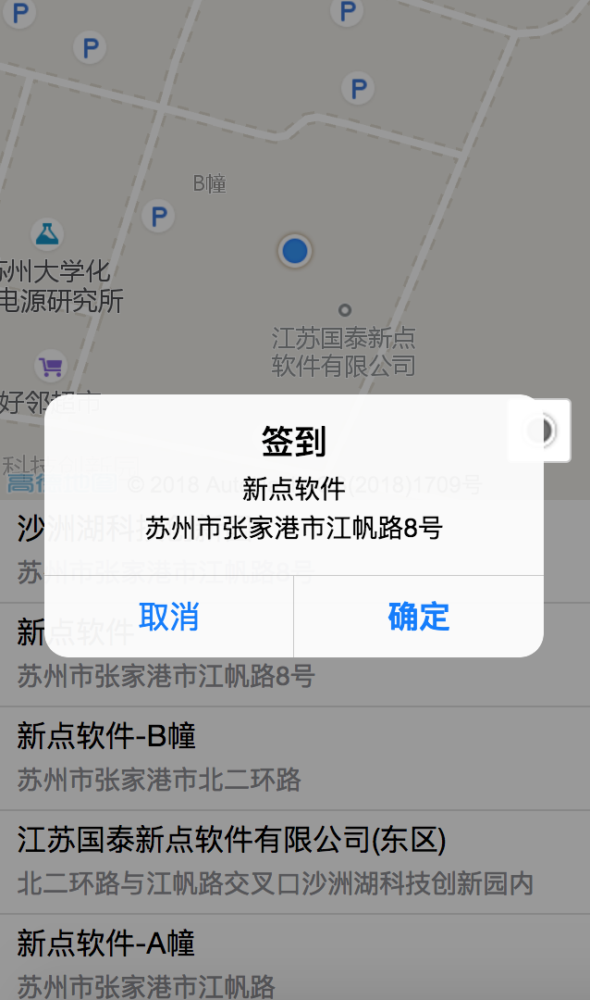

# 高德结合百度地图考勤签到组件

## 使用场景

- 如果单独使用百度地图定位，极大可能性会出现定位不准的情况。

- 考勤前签到等需要用到地图定位的地方 (PC、移动均可以)。

## 实例展示





- [在线预览](http://fe.epoint.com.cn:8080/m7showcase/showcase/widgets/amap/amap.html)

**二维码：**


## 依赖资源

- `http://webapi.amap.com/maps?v=1.4.6&key=f2cb2852df505ce99f414bff0b93915b`
- `http://api.map.baidu.com/api?v=2.0&ak=K5LXDCfHLnGvLDQsZx0AKyXNV5kLObYF`
- `amap.min.js`

## 使用

通过 `script` 标签依次引入

```html
<script src="http://webapi.amap.com/maps?v=1.4.6&key=f2cb2852df505ce99f414bff0b93915b"></script>
<script src="http://api.map.baidu.com/api?v=2.0&ak=K5LXDCfHLnGvLDQsZx0AKyXNV5kLObYF"></script>
<script src="./dist/amap.min.js"></script>
```

## 配置和方法

__DOM结构__

一个 `div` 即可

```html
<div id="container"></div>
```

__初始化__

以下是一个初始化百度地图，并搜索周围 `500` 米热点的示例

```js
var aMap = new AMAP({
    container: '#container',
    poiCallback: function(data) {
        // data 返回的是根据当前定位返回的周边 radius 附近的 poi
        nearListEl.innerHTML = Mustache.render(tpl, {
            items: data.pois
        });
    },
    onComplete: function(data) {
        // data 返回的是当前定位的信息
    },
    onError: function(err) {
        console.log(err);
    },
    radius: 500
});
```

__参数说明__

| 参数 | 参数类型  | 说明  |
| :------------- |:-------------:|:-------------|
| container | String或HTMLElement | `必选`容器，默认为`#amap` |
| poiCallback | Function | `可选`根据当前地理位置，获取周边 `radius` 米内的 `poi` 信息 |
| radius | Number | `可选`检索附近多少米内的 `poi` 信息, 默认 `1000` |
| onComplete | Function | `可选`定位成功后触发 |
| onError | Function | `可选`定位失败后触发 |
| map | Object | `可选`可参考高德地图 `Map` 类配置 [Map类配置项](http://lbs.amap.com/api/javascript-api/reference/map) |
| geolocation | Object | `可选`可参考高德地图 `AMap.Geolocation` 插件配置 [AMap.Geolocation插件配置项](http://lbs.amap.com/api/javascript-api/reference/location#m_AMap.Geolocation) |